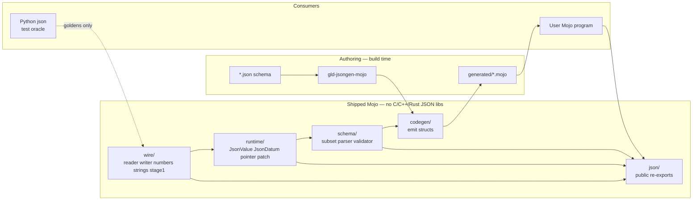

# JSON for Mojo (`mojo-json`)

| Field | Value |
| --- | --- |
| **Document title** | JSON serializer for the Mojo programming language |
| **Author** | Leonid Ganeline |
| **Date** | 2026-09-09 |
| **Status** | Draft (rev 3) |
| **Target repo** | `/home/leo/PycharmProjects/GLD/gld-json` (greenfield standalone library; only a local `.env` as of 2026-09-09) |
| **License** | MIT, Copyright (c) 2026 Leonid Ganeline |
| **Recommended Mojo pin** | `mojo == 1.0.0` (stable, 2026-08-11) |
| **Spec targets** | [RFC 8259](https://www.rfc-editor.org/rfc/rfc8259.html) (JSON), [RFC 7464](https://www.rfc-editor.org/rfc/rfc7464.html) is **not** a target (that is JSON text sequences with RS). v1 streaming text is [JSON Lines / NDJSON](https://jsonlines.org/). [RFC 6901](https://www.rfc-editor.org/rfc/rfc6901.html) (JSON Pointer), [RFC 6902](https://www.rfc-editor.org/rfc/rfc6902.html) (JSON Patch), [RFC 7396](https://www.rfc-editor.org/rfc/rfc7396.html) (JSON Merge Patch). JSON Schema **subset** listed under Schema (not the full 2020-12 vocabulary). |

---

## Overview

There is no from-scratch, schema-driven JSON library for Modular Mojo that ships both a typed codegen path and a dynamic value tree as of 2026-09-09. Two community libraries exist: EmberJson (`bgreni/EmberJson`, reflection `serialize` / `deserialize`, the timed bar in `seriailizer-benchmark`) and ehsanmok/json (Python-like `loads` / `dumps` on a tape-backed `Value`, plus JSONPath, Patch, and a draft-07 schema validator). Neither emits typed Mojo structs from a schema. This document specifies a **standalone, from-scratch Mojo** JSON library for the empty `gld-json` repository: independently buildable layers (`wire`, `schema`, `codegen`, `runtime`) plus a `json` facade, a Mojo CLI that reads a JSON Schema subset in-process, generated structs with explicit `encoded_len` / `encode_to` / `decode_from`, and a dynamic `JsonValue` tree that can encode and decode any well-formed RFC 8259 value without a schema.

**Hard product constraint:** the shipped runtime and the codegen walker have **zero C, C++, or Rust JSON library dependencies**. They do not wrap, link, FFI, bind, or vendor simdjson, yyjson, rapidjson, serde_json, sonic-rs, nlohmann/json, EmberJson, or ehsanmok/json. Python `json` is a **test oracle** only. SIMD is allowed only as Mojo `SIMD` types, not as a C++ simdjson shim.

v1 matches both existing Mojo JSON libraries on RFC 8259, pretty-print, JSON Lines, JSON Pointer, JSON Patch, JSON Merge Patch, and a dynamic value tree. The locked increment is an in-Mojo JSON Schema subset that both validates instances **and** emits typed structs (`gld-jsongen-mojo`). Neither competitor has schema-driven codegen. ehsanmok’s draft-07 validator is wider than this subset (`minimum`, `pattern`, `additionalProperties`, `allOf`, `not`); GPU parse, JSONPath, and simdjson FFI stay out of v1. The speed target times the **generated** path, not reflection and not the DOM.

The first test records (`Message`, `Document`, `Telemetry`, `Strings`, `Event`, `Batch_*`, `LongList`, mutual `A`/`B`) live under this repo’s `testdata/` as ordinary unit and interop test material. They are not the product schema and they are not a dependency on any other repository.

---

## Background & Motivation

### Why this change is needed

Mojo 1.0 shipped on 2026-08-11 with source stability, ownership, and SIMD types. A Mojo program that speaks JSON today either reflects through EmberJson or builds a `Value` tree in ehsanmok/json. Reflection walks Mojo fields at compile time; it cannot bake object keys, pre-size a writer from a schema, or emit `Optional[Box[T]]` for a recursive named type. ehsanmok/json’s timed path in `seriailizer-benchmark` is a hand-built DOM (`ehsanmok_ser.mojo`) because its reflection API cannot cover `Int32` or `List[struct]`. A reusable codec needs a schema language, generated methods, and a generic tree, the same product shape as `gld-cbor`.

JSON is a different format from CBOR. The text is self-describing (every value starts with `{`, `[`, `"`, a digit, `-`, `t`, `f`, or `n`), object keys are always strings, and the schema language is JSON Schema rather than CDDL. The product packaging is the same: pixi + Mojo 1.0, layered `.mojoc` packages, Python oracle goldens, MkDocs Pages, conda on prefix.dev.

### Current state of the repo

- `/home/leo/PycharmProjects/GLD/gld-json` is an empty directory except a local `.env` that holds `PREFIX_API_KEY`. It is not a git repository.
- `leo-gan/gld-json` does not exist on GitHub yet.
- Two Modular-Mojo JSON packages exist and are **competitors**, not dependencies: EmberJson 0.3.4 (the real speed bar) and ehsanmok/json 0.3.0.

### Pain points this library must not inherit

- A stub that only knows the five v2 test records.
- Any linked C/C++/Rust JSON implementation, including an optional simdjson FFI path.
- A reflection-only encoder: Mojo reflection sees Mojo fields, not JSON object key order or schema `required`.
- Coupling the library to `seriailizer-benchmark` or any other monorepo.
- Claiming JSON5, comments, or trailing commas while advertising RFC 8259.
- Committing `.env` or `temp/`.

---

## Goals & Non-Goals

### Goals (v1 product)

1. **100% from-scratch Mojo** encode/decode of RFC 8259 values, pretty-print, and JSON Lines / NDJSON.
2. Independently buildable layers: `wire/`, `schema/`, `codegen/`, `runtime/`, plus `json/` facade.
3. Parse the locked JSON Schema subset in Mojo. No host JSON Schema compiler is required to run codegen.
4. CLI `gld-jsongen-mojo` emits typed Mojo structs with explicit `encoded_len` / `encode_to` / `decode_from`.
5. Dynamic `JsonValue` (arena of nodes) for schema-free encode/decode of any well-formed value.
6. JSON Pointer (RFC 6901), JSON Patch (RFC 6902), and JSON Merge Patch (RFC 7396) on `JsonValue`.
7. Schema instance validation for the locked keyword subset.
8. Optional members are `Optional[T]`. Two-branch `null` unions are `Optional[T]`. Other unions of named objects are tagged Mojo structs whose JSON encoding is the selected branch object with no wrapper.
9. Interop on known data with official Python `json` (`json.dumps` / `json.loads`).
10. Decoder walks a `Span[Byte]`. Encoder writes into a `List[Byte]` pre-sized from `encoded_len` when the size is known. Owned `String` / `List` on decode.
11. Typed `DecodeError` with `kind: Int`, `offset: Int`, and `field: Int` (`0` means unknown).
12. Independently useful library. Not coupled to any other project.
13. Recursive named types in generated code: detect cycles on the named-type graph with strongly connected components. Emit heap `Box` for any field whose type (after unwrapping optional / array) is in the current type’s SCC. Testdata includes `LongList` and mutual `A`/`B`. Non-optional recursive fields are a codegen error.
14. On every suite type in `seriailizer-benchmark` (`message`, `document`, `telemetry`, `strings`, `event`, both `n=1` and `n=100`), the generated path is **50–200% faster** than EmberJson and ehsanmok/json. EmberJson is the real bar.

### Non-goals (v1)

- JSON5, comments, trailing commas, unquoted keys, single-quoted strings, or `NaN` / `Infinity` tokens.
- JSONPath (RFC 9535).
- Full JSON Schema 2020-12 vocabulary: `unevaluated*`, the format-assertion suite, remote `$ref`, `$dynamicRef`, `if`/`then`/`else`, `dependentSchemas`, `prefixItems`, `contains`, `patternProperties`.
- GPU parse.
- C/C++/Rust JSON libraries, even as an optional path. No simdjson FFI.
- Reflection-driven encode of arbitrary non-generated Mojo structs.
- RFC 7464 JSON text sequences (RS-delimited). JSON Lines is the v1 streaming text form.

### Later (explicitly planned, not v1)

- A larger JSON Schema vocabulary (`minimum` / `maximum` / `minLength` / `maxLength` / `minItems` / `pattern` / `additionalProperties`).
- Zero-copy `StringSpan` views on unescaped strings.
- A pull decoder that yields one JSON Lines record without buffering the rest.
- Remote `$ref` from a local file catalog (still no network).

---

## Proposed Design

### Product naming

| Surface | Name | Rationale |
| --- | --- | --- |
| Git repository | `gld-json` | Directory already created; GitHub repo to create. |
| Public Mojo import | `json` | What generated code and apps write (`from json import …`). |
| Conda / pixi package | `mojo-json` | Avoids colliding with conda-forge / PyPI `json`. |
| Codegen CLI | `gld-jsongen-mojo` | Matches `gld-cborgen-mojo` / `gld-protoc-mojo` / `gld-avrogen-mojo`. |
| Trait | `JsonDatum` | Generated test type `Message` keeps the name `Message`. |

### Packaging bootstrap (locked)

| Fact | Value |
| --- | --- |
| Initial `pixi.toml` version | `0.1.0`. Intermediate PRs do not bump it. One bump + prefix.dev publish after PRs 1–18 are on `main`. |
| Channels | `https://conda.modular.com/max` and `conda-forge`. |
| Platforms | `["linux-64"]`. |
| Mojo pin | `mojo == 1.0.0` in pixi; recipe build pin `mojo-compiler == 1.0.0`. |
| pixi tasks | `test`, `golden`, `generate`, `precompile`, `check-generated` (same five names as `gld-cbor/pixi.toml`). Feature `bench` (PR 17) adds EmberJson and task `microbench = "bash scripts/run-microbench.sh"`. CI after PR 18 runs `pixi run --feature bench microbench`. |
| `from json import …` | Development: `mojo -I src`. Installed package: `$PREFIX/lib/mojo/json.mojoc` plus the other published `.mojoc` files. Generated code imports only the `json` facade. |
| Oracle extra | pixi feature `oracle` with `python` for `scripts/gen_golden.py`. The stdlib `json` module is the oracle. Not a runtime dependency. |
| Recipe about | homepage `https://leo-gan.github.io/gld-json/`; repository `https://github.com/leo-gan/gld-json`; license MIT; test via `conda.recipe/test_import.mojo`. |
| Secrets | `.env` and `temp/` are gitignored. `PREFIX_API_KEY` is a GitHub Actions secret and a local file. It is never committed. |
| Publish channel | `https://prefix.dev/leo-gan/leo-gan`. Automatic publish on GitHub Release (`publish.yml`). |

**Precompile order** (`scripts/precompile.sh`). The graph is acyclic: `schema` walks `JsonValue` and therefore depends on `runtime`. `runtime` does **not** import `schema`. Generated types never parse a schema at runtime.

1. `wire.mojoc` (no in-repo deps)
2. `runtime.mojoc` (needs `wire`)
3. `schema.mojoc` (needs `runtime`)
4. `json.mojoc` (needs all of the above)

The CLI is a separate `mojo build` of `src/codegen/cli.mojo` → `gld-jsongen-mojo`.

### Four-plus-one layer architecture

```text
gld-json/
├── src/wire/      # RFC 8259 reader/writer, numbers, strings, UTF-8, structural index
├── src/schema/    # JSON Schema subset model, parser, validator
├── src/codegen/   # gld-jsongen-mojo
├── src/runtime/   # JsonValue, JsonDatum, pretty, JSON Lines, Pointer, Patch
└── src/json/      # public facade
```



### Repository layout

```text
gld-json/
  pixi.toml                      # mojo==1.0.0; optional python for oracle only
  pixi.lock
  LICENSE                        # MIT, Copyright (c) 2026 Leonid Ganeline
  README.md
  DESIGN.md                      # this document, committed in PR 1
  .gitignore                     # includes .env and temp/
  src/
    wire/
      __init__.mojo
      reader.mojo                # WireReader over Span[Byte]
      writer.mojo                # WireWriter into List[Byte]
      number.mojo                # Int64 / Float64 parse and emit
      string.mojo                # escape / unescape
      utf8.mojo                  # String(from_utf8=) → DecodeError remap
      classify.mojo              # byte-class tables
      stage1.mojo                # SIMD structural index (correctness stub, speed PR fills)
    schema/
      __init__.mojo
      model.mojo                 # SchemaDoc / SchemaType / SchemaProp
      parse.mojo                 # JsonValue → SchemaDoc
      validate.mojo              # instance check
      scc.mojo                   # named-type SCC for Box
    codegen/
      __init__.mojo
      names.mojo                 # reserved-name table
      emit.mojo                  # walk model → Mojo source
      cli.mojo                   # gld-jsongen-mojo main()
    runtime/
      __init__.mojo
      error.mojo                 # DecodeError
      options.mojo               # EncodeOptions / DecodeOptions
      value.mojo                 # JsonValue arena
      datum.mojo                 # trait JsonDatum + encode/decode
      box.mojo                   # heap Box[T]
      pretty.mojo                # indented writer helpers
      jsonl.mojo                 # JSON Lines
      pointer.mojo               # RFC 6901
      patch.mojo                 # RFC 6902
      merge.mojo                 # RFC 7396
    json/
      __init__.mojo              # public re-exports
  testdata/
    schema/                      # JSON Schema documents for tests and codegen
    golden/                      # oracle .json + .hex from scripts/gen_golden.py
    jsonl/                       # NDJSON samples
    pointer/                     # RFC 6901 examples
    patch/                       # RFC 6902 / 7396 examples
    suite/                       # time-boxed JSONTestSuite y_ / n_ subset
  tests/
    test_*.mojo
    generated/                   # committed output of gld-jsongen-mojo
    manual_types.mojo
  tests_interop/
    encode_ref.py
    decode_ref.py
    interop.sh
  examples/
    encode_value.mojo
  benches/                       # local microbench used in the speed PR
  scripts/
    run-tests.sh
    generate.sh
    check-generated.sh
    precompile.sh
    ci-setup.sh
    gen_golden.py
  conda.recipe/
    recipe.yaml
    test_import.mojo
  docs/
    index.md
    why-json.md
    instructions.md
    examples.md
    test-data.md
  mkdocs.yml
  requirements-docs.txt
  .github/workflows/
    ci.yml
    pages.yml
    publish.yml
```

`temp/` is not listed. It is gitignored scratch.

### How `from json import` resolves

| Context | Mechanism |
| --- | --- |
| In-repo tests / examples | `mojo run -I src …`. pixi task: `test = "bash scripts/run-tests.sh"`. |
| Generated code | `from json import JsonDatum, WireWriter, WireReader, DecodeError` — requires `-I src` (or `MOJOPATH` including `src`). |
| Downstream git checkout | Document `mojo -I path/to/gld-json/src`. |
| After `mojo precompile` / conda | `json.mojoc` installed to `$PREFIX/lib/mojo/`; the compiler auto-discovers it. |

`src/json/__init__.mojo` re-exports the public surface. It does **not** re-export `schema` internals or `codegen`.

---

## Surface versus competitors

Sources: the installed EmberJson 0.3.4 tree used by the bench (`seriailizer-benchmark/mojo/.pixi/envs/default/etc/conda/test-files/emberjson/0/emberjson/`); the timed call path in `emberjson_ser.mojo` (`serialize` / `deserialize`); EmberJson `main` README as of 2026-09-09; ehsanmok/json `__init__.mojo` vendored at `seriailizer-benchmark/mojo/vendor/ehsanmok_src/ehsanmok_json/`.

The EmberJson 0.3.4 column is **what is present in that tree**, not only the four names re-exported at the top of `__init__.mojo`. A note in the cell marks submodule-only APIs.

| Capability | EmberJson 0.3.4 (installed tree) | EmberJson `main` | ehsanmok/json 0.3.0 | **gld-json v1** |
| --- | --- | --- | --- | --- |
| RFC 8259 compact encode/decode | yes (`serialize` / `parse`) | yes (`to_json` / `from_json`) | yes (`dumps` / `loads`) | **yes** |
| Pretty-print | yes (`to_string[pretty=True]`) | yes (`to_json_pretty`) | yes (`dumps(..., indent=)`) | **yes** |
| Dynamic value tree | `Value` / `Object` / `Array` plus tape `Document` (`parse_document`) | `Value` + tape `Document` | tape-backed `Value` | **`JsonValue` arena** |
| Typed structs | reflection | reflection + emberserde | reflection (no `Int32` / `List[struct]`) | **codegen `JsonDatum`** |
| Schema-driven codegen CLI | no | no | no | **`gld-jsongen-mojo`** |
| JSON Schema parse in-process | no | no | validator only (draft-07 subset, wider than v1) | **subset parser + validate + codegen** |
| JSON Pointer (RFC 6901) | `Value.get` + `parse_pointer` / `try_parse_pointer` | `parse_pointer` + `get` | no (has JSONPath instead) | **yes** |
| JSON Patch (RFC 6902) | yes in `patch/_patch.mojo` (not top-level re-export) | same family | `apply_patch` | **yes (facade)** |
| JSON Merge Patch (RFC 7396) | yes in `patch/_merge.mojo` (not top-level re-export) | same family | `merge_patch` | **yes (facade)** |
| JSON Lines / NDJSON | yes (`read_lines` / `write_lines` in `jsonl.mojo`) | yes | `parse_ndjson` / `load[format='ndjson']` | **yes** |
| JSONPath (RFC 9535) | no | no | `jsonpath_query` | **no (v1)** |
| Comments / trailing commas | no | no | opt-in `ParserConfig` | **no** |
| GPU parse | no | no | `target='gpu'` | **no** |
| simdjson FFI | no | no | `target='cpu-simdjson'` | **no** |
| In-Mojo SIMD structural index | yes (`_index/`); **not** the timed bench path | SIMD UTF-8 + pointer hops | two-pass tape (`cpu/stage1.mojo`) | **yes, Mojo `SIMD` only; used only if decode is still short of 1.5×** |

The unique v1 increment versus both libraries is schema-driven typed codegen plus an in-process schema that emits structs. Pointer, Patch, Merge Patch, JSON Lines, pretty-print, and a value tree are already in EmberJson 0.3.4 and/or ehsanmok/json. ehsanmok’s validator is wider than the locked subset; GPU, JSONPath, and simdjson FFI stay out of v1. The timed path is generated `JsonDatum`, not reflection.

---

## Mojo 1.0 constraints

These were learned on `gld-cbor` / `gld-protobuf` / `gld-avro`. Implementers must not rediscover them.

| Topic | What is true in 1.0 | Design consequence |
| --- | --- | --- |
| Functions | Use `def`, not `fn`, in this family’s code. | All snippets in this document use `def`. |
| Tuples | Written `Tuple[T]`, not `(T,)`. | `read` helpers return `Tuple[Int, UInt64]`. |
| Origins | Documented name is `ImmOrigin`. Use `Self.origin`. | `WireReader[origin: ImmOrigin]`. |
| Inits | No `@fieldwise_init` together with a custom `__init__`. | Codegen emits an explicit zero-arg `__init__` and a fieldwise overload. |
| `List` | Not `ImplicitlyCopyable`. No `List[T](a, b)` in some builds. | `append`. Transfer with `append(item^)`. |
| SIMD | `to_bits()` needs `UInt64(...)`. Shifts need a same-width RHS. | Stage-1 masks are `UInt64`. |
| Strings | `String[i]` is a UTF-8 span. Use `as_bytes()` / `[byte=]`. | Key compare is byte-wise. |
| Traits | Decode traits need `Deinitable`. | `JsonDatum(Copyable, Movable, Defaultable, Deinitable)`. |
| Keywords | `var` / `match` / `fn` / `struct` clash. | Rename to `struct_`, `fn_`, `var_`. |
| Recursion | Recursive `List[MessageDesc]` may not be `Deinitable`. | Flatten schema members into a side table. `JsonValue` is an arena. `Box[T]` is a one-element `List`. |
| Inits | Explicit inits only. | No defaulted fieldwise synthesis. |

`Box[T]` is re-exported from `json`. Implementation matches `gld-cbor` / `gld-avro`: a one-element `List[T]` (a raw `Pointer` cell double-frees on copy in Mojo 1.0). API: `__init__(var value: T)` and `__getitem__` returning a copy of `T`.

---

## Wire format (RFC 8259)

JSON text is a single value with optional surrounding whitespace. A decoder does not need a schema to walk a value. Whitespace is space (`0x20`), tab (`0x09`), LF (`0x0A`), and CR (`0x0D`) only.

### Grammar the library implements

```text
value     = object / array / string / number / true / false / null
object    = "{" [ member *( "," member ) ] "}"
member    = string ":" value
array     = "[" [ value *( "," value ) ] "]"
string    = '"' *char '"'
number    = [ "-" ] int [ frac ] [ exp ]
int       = "0" / ( %x31-39 *DIGIT )
frac      = "." 1*DIGIT
exp       = ("e" / "E") [ "+" / "-" ] 1*DIGIT
true      = "true"
false     = "false"
null      = "null"
```

Rejected on every decode (not only strict):

| Input | Error |
| --- | --- |
| Comments `//` or `/* */` | `KIND_SYNTAX` |
| Trailing comma `{ "a": 1, }` | `KIND_SYNTAX` |
| Unquoted key | `KIND_SYNTAX` |
| Single-quoted string | `KIND_SYNTAX` |
| `NaN` / `Infinity` / `-Infinity` tokens | `KIND_SYNTAX` |
| Leading zeros `01`, `-01` | `KIND_NUMBER` |
| Bare `+1` | `KIND_NUMBER` |
| Hex `0x10` | `KIND_NUMBER` |
| Invalid UTF-8 | `KIND_UTF8` |
| Lone surrogate `\uD800` without a low pair | `KIND_ESCAPE` |
| Unescaped control byte `0x00`–`0x1F` inside a string | `KIND_ESCAPE` |
| Trailing bytes after one value | `KIND_TRAILING` (single-item `decode` only) |
| Leading UTF-8 BOM (`EF BB BF`) | `KIND_SYNTAX`. RFC 8259 does not require a BOM; this library rejects it. |

### Strings and escapes

A string is UTF-8 between quotes. The decoder copies into an owned `String`.

| Escape | Meaning |
| --- | --- |
| `\"` `\\` `\/` | quote, backslash, slash |
| `\b` `\f` `\n` `\r` `\t` | U+0008, U+000C, U+000A, U+000D, U+0009 |
| `\uXXXX` | one UTF-16 code unit. A high surrogate must be followed by `\uXXXX` low surrogate. The pair becomes one UTF-8 scalar. |
| any other `\x` | `KIND_ESCAPE` |

Unescaped `/` is legal. Encode of `/` does **not** write `\/` (Python `json.dumps` default). Encode of a string with no bytes that need escaping is a memcpy of the UTF-8 payload between two quote bytes.

`string_from_utf8` catches the default `Error` from `String(from_utf8=)` and raises `DecodeError(KIND_UTF8, offset)`. Never `unsafe_from_utf8`. Never lossy.

### Number policy (locked)

This is the simdjson-style split, with a hard reject instead of a raw decimal leftover.

1. Scan the RFC 8259 number production. A leading `0` may be followed only by `.`, `e`/`E`, or the end of the number.
2. If the token has **no** `.` and **no** exponent, try to parse it as `Int64`.
   - Success → `JsonValue` kind `INT`, payload `Int64`. This includes `0` and every integer in `[Int64.MIN, Int64.MAX]`.
   - Failure because the magnitude does not fit `Int64` → fall through to `Float64`.
3. Otherwise parse as IEEE 754 binary64.
   - Finite → kind `FLOAT`, payload `Float64` (this includes `-0`, `0.0`, `1e2`, and integers that overflow `Int64` but are still finite doubles, such as `9223372036854775808`).
   - Not finite (`Inf` / overflow past ~1e308) → `KIND_RANGE`.
4. There is **no** raw-decimal kind on the hot path.

`-0` and `-0.0` are `FLOAT` negative zero. `0` is `INT` zero. Python `json.loads("-0")` is `0` (int) and `json.loads("-0.0")` is `-0.0`; our rule is closer to simdjson than to CPython for `-0` without a fraction. Goldens that compare against Python `json` for `-0` document this deviation once.

Encode of `INT` uses a signed itoa with no quotes and no leading zeros (except `0`). Encode of `FLOAT` uses a shortest round-trip that `json.loads` recovers as the same `Float64` bits, except signed zero, which is written `-0.0`. `NaN` and `Infinity` **cannot** appear in a well-formed `JsonValue`. A generated `Float64` field that is not finite raises `KIND_RANGE` on encode.

### Objects and arrays

An object is an ordered list of string-keyed pairs. This is not a `Dict`. Duplicate keys are well-formed on default decode; **last-key-wins** when projecting to a generated struct or when `JsonValue.get` looks up a key. Optional `DecodeOptions.strict_keys` rejects a second identical key (`KIND_DUP_KEY`).

An array is an ordered list of values.

Generated structs write an object in **schema property order**. `None` optionals **omit** the pair. There is no trailing comma. The writer uses a first-flag: write `","` (pretty: `",\n"` plus indent) **before** every present member after the first. `encoded_len` uses the same walk. Unknown keys on decode are **ignored**. Missing required keys are `KIND_SCHEMA`.

For an `Optional[T]` field:

| Input | Result |
| --- | --- |
| key absent | `None` |
| key present with JSON `null` | `None` |
| key present with a `T` value | `Some(T)` |
| JSON `null` on a **required** non-null field | `KIND_TYPE` |

### Depth and size caps

| Cap | Value | Error |
| --- | --- | --- |
| Nesting depth (array / object) | 100 | `KIND_DEPTH` |
| Single string (decoded UTF-8 bytes) | 64_194_304 | `KIND_RANGE` |
| Array length or object pair count | 1_048_576 | `KIND_RANGE` |
| JSON Lines record count | 1_048_576 | `KIND_RANGE` |
| Input length | `Int` max; a length that does not fit `Int` is `KIND_RANGE` | `KIND_RANGE` |

---

## Pretty-print and JSON Lines

### Pretty-print

Default `encode(...)` is compact: no extra whitespace, no space after `:`, no space after `,`. That matches Python `json.dumps(obj, separators=(",", ":"), ensure_ascii=False, allow_nan=False)`.

Pretty-print is `EncodeOptions.pretty` (indent two spaces, one value per line, space after `:`). EmberJson and ehsanmok/json both pretty-print; v1 must too.

```mojo
struct EncodeOptions(Copyable, ImplicitlyCopyable):
    var mode: Int
    var indent: Int

    comptime COMPACT = 0
    comptime PRETTY = 1

    comptime compact = EncodeOptions(mode=Self.COMPACT, indent=0)
    comptime pretty = EncodeOptions(mode=Self.PRETTY, indent=2)
```

`encoded_len` is exact for compact. For pretty it is exact and depth-aware (two-pass, no temporary buffer). `indent` other than `0` or `2` is accepted as a space count so tests can match a Python `indent=N` golden; the advertised API is `compact` and `pretty`.

The public trait method `encoded_len(self, options)` is the **depth-0** entry. `encode()` and `encode_into()` call only that method. Generated bodies do **not** call `child.encoded_len(options)` in pretty mode: that would size the child as a top-level value (2-space indent) while `encode_to` writes it at `pretty_depth + 1`. Pretty size walks with a private helper `encoded_len_at(self, options, depth: Int)` (or an equivalent local `depth` in the emitted function). Compact mode has no indent, so it may still call `child.encoded_len(options)`.

`WireWriter` holds `pretty_depth: Int` (0 at the top-level value). Generated `encode_to` consults `options.mode` and `w.pretty_depth`. After writing `{` or `[` in pretty mode it increments depth; after `}` or `]` it decrements. The trait does not take a depth parameter.

There is no `sort_keys` flag on generated encode. Schema property order is the order. `encode_value` of a `JsonValue` writes pairs in arena order.

### JSON Lines / NDJSON

A JSON Lines buffer is zero or more RFC 8259 values separated by `\n`. A `\r\n` line ending is accepted on decode. Empty lines and whitespace-only lines are skipped. An empty buffer is a valid empty sequence.

```mojo
def encode_jsonl[T: JsonDatum](items: List[T]) -> List[Byte]
def decode_jsonl[T: JsonDatum, origin: ImmOrigin](buf: Span[Byte, origin], options: DecodeOptions = DecodeOptions.default) raises DecodeError -> List[T]
def encode_jsonl_values(items: List[JsonValue]) -> List[Byte]
def decode_jsonl_values[origin: ImmOrigin](buf: Span[Byte, origin], options: DecodeOptions = DecodeOptions.default) raises DecodeError -> List[JsonValue]
```

Each record is written compact, then one `\n`. There is no trailing-garbage rule for the sequence as a whole: the decoder consumes records until the buffer ends. A truncated final record is `KIND_EOF`. Single-item `decode[T](buf)` still requires exactly one value; leftover bytes are `KIND_TRAILING`.

This is JSON Lines, not RFC 7464 (no RS `0x1E` prefix).

---

## `JsonValue` data model

Mojo 1.0 cannot form a Deinitable recursive enum. `JsonValue` is an arena, matching `CborValue` in `gld-cbor/src/runtime/value.mojo`.

```mojo
comptime JK_NULL = 1
comptime JK_FALSE = 2
comptime JK_TRUE = 3
comptime JK_INT = 4
comptime JK_FLOAT = 5
comptime JK_STRING = 6
comptime JK_ARRAY = 7
comptime JK_OBJECT = 8

struct JsonNode(Copyable, ImplicitlyCopyable):
    var kind: Int
    var a: Int64      # INT value; string start; first child / first key
    var b: UInt64     # FLOAT bits; string length; count
    var c: Int        # first value index for objects

struct JsonValue(Movable):
    """Arena of JSON values. Nested containers use `kids` as a child-index table."""

    var nodes: List[JsonNode]
    var kids: List[Int]
    var texts: List[String]
    var root: Int

    def __init__(out self):
        self.nodes = List[JsonNode]()
        self.kids = List[Int]()
        self.texts = List[String]()
        self.root = 0
```

**Packing (locked):**

| Kind | `a` | `b` | `c` |
| --- | --- | --- | --- |
| `JK_NULL` / `JK_FALSE` / `JK_TRUE` | 0 | 0 | 0 |
| `JK_INT` | `Int64` value | 0 | 0 |
| `JK_FLOAT` | 0 | IEEE bits | 0 |
| `JK_STRING` | start in `texts` | UTF-8 length | 0 |
| `JK_ARRAY` | first child index in `kids` | count | 0 |
| `JK_OBJECT` | first **key** index in `kids` | pair count | first **value** index in `kids` |

Object decode appends all key node indexes, then all value node indexes. Pair `i` is `kids[first_key + i]` / `kids[first_value + i]`. Array children are contiguous in `kids`.

Public constructors (each returns a one-root `JsonValue`; `json_array` / `json_object` copy child arenas into the new one):

```mojo
def json_null() -> JsonValue
def json_bool(v: Bool) -> JsonValue
def json_int(v: Int64) -> JsonValue
def json_float(v: Float64) -> JsonValue
def json_string(s: String) -> JsonValue
def json_array(items: List[JsonValue]) -> JsonValue
def json_object(pairs: List[Tuple[String, JsonValue]]) -> JsonValue
```

Read API on `JsonValue` (operates on `root`). Schema parse, Pointer, and Patch use **only** this API. They do not poke `nodes` / `kids` directly.

```mojo
def kind(self) -> Int
def is_null(self) -> Bool
def is_bool(self) -> Bool
def is_int(self) -> Bool
def is_float(self) -> Bool
def is_string(self) -> Bool
def is_array(self) -> Bool
def is_object(self) -> Bool
def as_bool(self) raises DecodeError -> Bool
def as_int(self) raises DecodeError -> Int64
def as_float(self) raises DecodeError -> Float64   # INT promotes to Float64
def as_str(self) raises DecodeError -> String
def __len__(self) -> Int                          # array length or object pair count
def at(self, i: Int) raises DecodeError -> JsonValue                  # array child, copied
def pair(self, i: Int) raises DecodeError -> Tuple[String, JsonValue] # object pair, copied
def get(self, key: String) raises DecodeError -> JsonValue            # last-key-wins
```

A wrong-kind `as_*` or an out-of-range index is `KIND_TYPE`. `get` of a missing key is `KIND_TYPE`.

---

## JSON Pointer, Patch, and Merge Patch

These operate on `JsonValue`. Generated types are not required to implement them. A caller who needs a pointer into a typed struct converts with `to_value` / `from_value` (not on the speed path):

```mojo
def to_value[T: JsonDatum](value: T) raises DecodeError -> JsonValue:
    return decode_value(encode(value))

def from_value[T: JsonDatum](v: JsonValue) raises DecodeError -> T:
    return decode[T](encode_value(v))
```

### RFC 6901 Pointer

A pointer is a Unicode string. `""` is the whole document. `/foo/0` is key `"foo"` then index `0`. `~1` is `/`. `~0` is `~`. Any other `~` escape is `KIND_POINTER`.

```mojo
def pointer_get(doc: JsonValue, ptr: String) raises DecodeError -> JsonValue
def pointer_set(doc: JsonValue, ptr: String, value: JsonValue) raises DecodeError -> JsonValue
```

Both functions are **copy-then-apply**. They return a new arena. `doc` is unchanged, including on failure. `pointer_get` copies the target node into a new `JsonValue`. `pointer_set("", value)` replaces the whole document (the result is a copy of `value`). Missing path is `KIND_POINTER`. A non-numeric array token, or `-` used as a get index, is `KIND_POINTER`. Out-of-range get index is `KIND_POINTER`. Inserts that would exceed `MAX_ITEM_BYTES`, pair/array `MAX_COUNT`, or `MAX_DEPTH` are `KIND_RANGE`.

### RFC 6902 Patch

A patch is a JSON array of operation objects. Implemented ops: `add`, `remove`, `replace`, `move`, `copy`, `test`.

```mojo
def apply_patch(doc: JsonValue, patch: JsonValue) raises DecodeError -> JsonValue
```

Copy-then-apply: the function returns a new document. `doc` is unchanged if any operation fails.

Rules locked to the RFC:

- `add` of `path == ""` replaces the whole document.
- `add` of `"/"` sets the empty-string key on a root object (or fails if the root is not an object).
- `add` on an existing object key replaces. `add` of `/arr/-` appends. `add` of `/arr/n` inserts at `n` (existing elements shift). `n` must be `<= len` (`n == len` is append).
- `remove` of a missing path fails. `remove` of `""` is `KIND_PATCH`.
- `replace` requires the path to exist. `replace` of `""` replaces the document.
- `move` / `copy` use `from`. Moving a path into one of its children fails.
- `test` compares values with RFC 6902 equality: arrays are order-sensitive; numbers compare by numeric value (`1` equals `1.0`); objects are compared as last-key-wins maps (duplicate keys collapse to the last value), then as a key-set (order-insensitive).
- Inserts apply the same count / depth / string caps as decode (`KIND_RANGE`). Patch cannot grow a tree past those caps.

### RFC 7396 Merge Patch

```mojo
def merge_patch(target: JsonValue, patch: JsonValue) raises DecodeError -> JsonValue
def create_merge_patch(source: JsonValue, target: JsonValue) -> JsonValue
```

Copy-then-apply. If `patch` is not an object, the result is `patch`. If it is an object, null values delete keys, nested objects recurse, other values replace. Inserts apply the same caps. `create_merge_patch` builds a patch that takes `source` to `target`.

---

## JSON Schema v1 subset

The schema language is JSON Schema. The parser is in-process Mojo, the analog of CBOR’s in-process CDDL parser. There is no host `jsonschema` compiler and no network `$ref`.

### How a schema is loaded

`schema/parse.mojo` decodes the file with `decode_value`, then walks the `JsonValue` into `SchemaDoc` using the public `JsonValue` read API. A construct that is JSON but not in this subset is `DecodeError(KIND_SCHEMA, offset)`. A file that is not JSON is a parse `DecodeError` (`KIND_SYNTAX` / `KIND_EOF` / …). There is no separate `SchemaError` type.

The CLI prints `DecodeError` (`kind`, `offset`, `field`) on stderr and exits non-zero. It writes no output files on failure.

CLI:

```bash
gld-jsongen-mojo --schema testdata/schema/benchmark_v2.json --out tests/generated
```

`--out` is the directory. The emitter never writes `__init__.mojo` above `--out`. Each named definition becomes `Name.mojo`. The root schema, if it has a `title` or `$id` fragment, becomes that name; otherwise the file stem.

### Keywords accepted

| Keyword | Meaning in v1 |
| --- | --- |
| `type` | `"object"` `"array"` `"string"` `"number"` `"integer"` `"boolean"` `"null"`, or a two-element array that is `{T, null}` in either order |
| `properties` | object members |
| `required` | list of property names that are not `Optional` |
| `items` | a single schema for every array element (not a tuple) |
| `$ref` | local only: `#`, `#/$defs/Name`, `#/definitions/Name` |
| `$defs` / `definitions` | named types |
| `enum` | decode-time membership. Field type is the homogeneous JSON type of the values. Mixed-type `enum` is a codegen error. |
| `const` | decode-time equality. |
| `oneOf` / `anyOf` | Two-branch `null` unions (`T` and `null`) become `Optional[T]`. Any other combination is a tagged union if every branch is a named object; otherwise a codegen error. |
| `$id` / `title` / `description` | accepted and ignored except as a name hint |
| `$schema` | accepted and ignored |

Anything else (`unevaluatedProperties`, `format`, `pattern`, `minimum`, `additionalProperties`, remote `$ref`, …) is `DecodeError.KIND_SCHEMA`. It is not silently skipped.

### Codegen mapping

| Schema | Mojo |
| --- | --- |
| `"type": "boolean"` | `Bool` |
| `"type": "integer"` | `Int64` |
| `"type": "number"` | `Float64` |
| `"type": "string"` | `String` |
| `"type": "null"` | not a field type alone |
| object + `properties` | struct fields. A name not in `required` is `Optional[T]`. Encode omits `None`. |
| `"type": ["null", T]` or `["T", "null"]` | `Optional[T]` |
| two-branch `oneOf` / `anyOf` with `null` | `Optional[T]` |
| other union of named objects | tagged Mojo struct `{ var tag: Int; … }`. **JSON wire is the selected branch object, no wrapper.** |
| `"type": "array", "items": T` | `List[T]` |
| `$ref` to a named def | that Mojo type |
| `enum` of strings / ints | the underlying type plus a decode check |
| `const` | the underlying type plus a decode check |

Identifiers that are Mojo keywords get a trailing underscore (`struct_`, `fn_`, `var_`). A unit test in `tests/test_codegen_names.mojo` feeds a schema with those names.

Recursive named types: mutual reachability on the named-type graph (same SCC). A field whose type, after unwrapping `Optional` / array, is in the current SCC becomes `Box[T]`. Nullable recursive fields are `Optional[Box[T]]` defaulting to `None`. A **non-optional** recursive field is a codegen error. Testdata `LongList` (`next` not required) and mutual `A`/`B` (each field optional) are the positive cases. A schema `{ "properties": { "next": { "$ref": "#" } }, "required": ["next"] }` fails the CLI.

A tagged union whose every branch is recursive is a codegen error; otherwise zero-arg init uses the first non-recursive branch. Mojo 1.0 still rejects *compiling* a struct that names itself through `Box[Self]`; the emitter writes that form and tests check the source.

#### Tagged-union JSON wire (locked)

Two named object schemas in `oneOf` / `anyOf` become one Mojo tagged struct. Encode writes the selected branch **as that branch’s object**. There is no `{"tag":…,"value":…}` wrapper and no discriminator property.

Decode saves the reader position, tries each named-object schema **in schema order**, and takes the first **closed** match. `try_match_object` succeeds only when all of these hold:

- the value is an object
- every `required` key of that branch is present
- every present key is in that branch’s `properties` (an unknown key is **not** a match)
- each present property type-checks against that branch

On failure the reader is rewound and the next branch is tried. If none match, `KIND_TYPE`.

Normal generated `decode_from` on a single object type still **ignores** unknown keys. Closed matching is only for union branch selection.

Overlapping schemas are a **codegen error**. Two branches overlap if and only if some object **closed-matches** both: `required(A) ∪ required(B) ⊆ properties(A) ∩ properties(B)` and the types of those shared properties are compatible. `Cat` (`required: [lives]`, properties `name`/`lives`) and `Dog` (`required: [breed]`, properties `name`/`breed`) do **not** overlap: `{ "lives": 9, "breed": "z" }` has an unknown key for each closed match. `testdata/schema/union.json` is that pair and must compile.

```mojo
# oneOf [Cat, Dog] — both objects. JSON is {"name":"x","lives":9} or {"name":"y","breed":"z"}.
def encode_to(self, mut w: WireWriter, options: EncodeOptions):
    if self.tag == 0:
        self.cat.encode_to(w, options)
    else:
        self.dog.encode_to(w, options)

def decode_from[origin: ImmOrigin](mut self, mut r: WireReader[origin]) raises DecodeError:
    var saved = r.position()
    var c = Cat()
    if c.try_match_object(r):
        self.tag = 0
        self.cat = c^
        return
    r.pos = saved
    var d = Dog()
    if d.try_match_object(r):
        self.tag = 1
        self.dog = d^
        return
    raise DecodeError(DecodeError.KIND_TYPE, saved)
```

`try_match_object` is a generated helper, not part of `JsonDatum`. It is not on the facade. It is **closed**: a key that is not in that branch’s `properties` makes the helper return false. The same type’s `decode_from` still skips extras.

Emitter writes explicit zero-arg `__init__` (zeros, empty lists, `None`) and a fieldwise overload. No `@fieldwise_init`.

### Instance validation

```mojo
def validate(instance: JsonValue, schema: SchemaDoc) -> ValidationResult
def is_valid(instance: JsonValue, schema: SchemaDoc) -> Bool
```

```mojo
comptime VK_TYPE = 1
comptime VK_REQUIRED = 2
comptime VK_ENUM = 3
comptime VK_CONST = 4
comptime VK_ITEMS = 5
comptime VK_REF = 6

struct ValidationError(Copyable, ImplicitlyCopyable):
    var path: String    # JSON Pointer
    var kind: Int       # VK_*

struct ValidationResult(Movable):
    var valid: Bool
    var errors: List[ValidationError]
```

`validate` never raises for a well-formed instance and schema. It records `VK_*` codes. Generated `decode_from` inlines the same checks as `DecodeError.KIND_TYPE` / `KIND_SCHEMA` and does not call `validate` at runtime.

---

## Mojo 1.0 wire contracts

These names are frozen for codegen.

```mojo
struct WireWriter(Movable):
    var buf: List[Byte]
    var pos: Int
    var pretty_depth: Int
    def __init__(out self, *, capacity: Int = 64, exact: Bool = False)
    def write_byte(mut self, b: Byte)
    def write_bytes[origin: ImmOrigin](mut self, data: Span[Byte, origin])
    def write_ascii(mut self, s: String)          # baked keys, literals
    def write_string(mut self, s: String)         # quoted + escaped
    def write_int(mut self, v: Int64)
    def write_float(mut self, v: Float64) raises DecodeError
    def write_bool(mut self, v: Bool)
    def write_null(mut self)
    def finish(deinit self) -> List[Byte]

struct WireReader[origin: ImmOrigin](Movable):
    var data: Span[Byte, Self.origin]
    var pos: Int
    var depth: Int
    var options: DecodeOptions
    # Stage-1 index. Empty on the correctness path. PR 18 fills these.
    var positions: List[UInt32]
    var idx: Int
    def __init__(
        out self,
        data: Span[Byte, Self.origin],
        *,
        options: DecodeOptions = DecodeOptions.default,
        depth: Int = 0,
    )
    def remaining(self) -> Int
    def position(self) -> Int
    def skip_ws(mut self)
    def peek(self) raises DecodeError -> Byte
    def expect(mut self, b: Byte) raises DecodeError
    def read_null(mut self) raises DecodeError
    def read_bool(mut self) raises DecodeError -> Bool
    def read_number(mut self) raises DecodeError -> Tuple[Int, Int64, Float64]  # kind, int, float
    def read_string(mut self) raises DecodeError -> String
    def skip_value(mut self) raises DecodeError
    def ensure_index(mut self) raises DecodeError
```

`decode`, `decode_value`, `decode_jsonl`, and `decode_from` are parameterized by `origin` on the input `Span[Byte, origin]`. They take `options: DecodeOptions = DecodeOptions.default` and pass it to `WireReader`. Nesting is capped by `options.max_depth` (there is no second depth field on the reader).

`write_float` raises `DecodeError(KIND_RANGE)` on a non-finite value. Encode reuses `DecodeError` so generated code has one error type (same posture as `gld-cbor` encode of a `CborValue` with duplicate keys). Compact generated encode of a well-formed value whose floats are finite does not raise.

**Stage-1 contract (frozen now, filled in PR 18):** `positions` / `idx` / `ensure_index` are part of `WireReader` from the first reader PR. Correctness PRs leave `positions` empty and implement `skip_value` / `decode_from` as scalar recursive descent. `ensure_index` is a no-op until PR 18. PR 18 may populate `positions` with structural byte offsets and teach `skip_value` to hop brackets on that index. It must not rename the reader or add a second undocumented reader type.

---

## Runtime API

The generated method is **`decode_from`**, not `merge_from`. JSON object replace semantics: the receiver is overwritten. Extra keys are ignored. There is no unknown-field store.

```mojo
trait JsonDatum(Copyable, Movable, Defaultable, Deinitable):
    def encoded_len(self, options: EncodeOptions) -> Int
    def encode_to(self, mut w: WireWriter, options: EncodeOptions)
    def decode_from[origin: ImmOrigin](mut self, mut r: WireReader[origin]) raises DecodeError

def encode[T: JsonDatum](value: T, options: EncodeOptions = EncodeOptions.compact) -> List[Byte]
def encode_into[T: JsonDatum](value: T, mut dest: List[Byte], options: EncodeOptions = EncodeOptions.compact) -> Int
def decode[T: JsonDatum, origin: ImmOrigin](buf: Span[Byte, origin], options: DecodeOptions = DecodeOptions.default) raises DecodeError -> T

def encode_value(value: JsonValue, options: EncodeOptions = EncodeOptions.compact) -> List[Byte]
def decode_value[origin: ImmOrigin](buf: Span[Byte, origin], options: DecodeOptions = DecodeOptions.default) raises DecodeError -> JsonValue

def encode_jsonl[T: JsonDatum](items: List[T]) -> List[Byte]
def decode_jsonl[T: JsonDatum, origin: ImmOrigin](buf: Span[Byte, origin], options: DecodeOptions = DecodeOptions.default) raises DecodeError -> List[T]
def encode_jsonl_values(items: List[JsonValue]) -> List[Byte]
def decode_jsonl_values[origin: ImmOrigin](buf: Span[Byte, origin], options: DecodeOptions = DecodeOptions.default) raises DecodeError -> List[JsonValue]

def encoded_string_len(s: String) -> Int
def encoded_int_len(v: Int64) -> Int
def encoded_float_len(v: Float64) -> Int
```

`encode` of a generated type walks fields in schema property order.

- An object schema writes `{...}`. `None` optionals **omit** the pair. Commas are written **before** every present member after the first (pretty: `",\n"` plus indent). There is never a trailing comma.
- An array schema writes `[...]` with the same first-flag comma rule.
- A scalar schema writes that token, not wrapped in an object.
- Object keys are baked as byte literals, including the quotes and colon, for example the seven bytes `"f_bool":`.

Public `encoded_len(options)` is the depth-0 entry and uses the same first-flag walk as `encode_to`. In pretty mode the generated body calls a private `encoded_len_at(options, depth)` and never `child.encoded_len(options)`. Compact mode may call the child method. Two-pass in place. `encode_into` resizes `dest` to `encoded_len` and returns the byte count, matching `gld-cbor`.

Binary (here: UTF-8) encode of a well-formed **generated** value with finite floats does not raise. Encode of a `JsonValue` never raises for structure. Decode raises `DecodeError`. `decode_from` replaces the receiver. It does not merge.

### `DecodeError` kinds

| Kind | Code | Meaning |
| --- | --- | --- |
| `KIND_EOF` | 1 | truncated |
| `KIND_SYNTAX` | 2 | unexpected byte, trailing comma, comment, bad literal |
| `KIND_NUMBER` | 3 | leading zeros, bare `+`, hex, empty fraction |
| `KIND_RANGE` | 4 | length, depth-adjacent size, or non-finite / overflowing number |
| `KIND_UTF8` | 5 | ill-formed text |
| `KIND_ESCAPE` | 6 | bad `\` sequence or unescaped control |
| `KIND_TYPE` | 7 | unexpected value kind for a generated field |
| `KIND_DEPTH` | 8 | nesting cap |
| `KIND_TRAILING` | 9 | extra bytes after one value |
| `KIND_DUP_KEY` | 10 | duplicate key in strict mode |
| `KIND_SCHEMA` | 11 | missing required, `enum` / `const` miss, schema compile |
| `KIND_POINTER` | 12 | JSON Pointer syntax or missing target |
| `KIND_PATCH` | 13 | JSON Patch / Merge Patch failure |

`field` is 0 unless a generated struct is filling a numbered member (1-based schema property index).

### `DecodeOptions`

```mojo
struct DecodeOptions(Copyable, ImplicitlyCopyable):
    var strict_keys: Bool
    var max_depth: Int

    comptime default = DecodeOptions(strict_keys=False, max_depth=100)
    comptime strict = DecodeOptions(strict_keys=True, max_depth=100)
```

Default read is last-key-wins. `strict` rejects duplicates. `WireReader` stores this struct and reads the depth cap from `options.max_depth`. There is no parallel `max_depth` field on the reader.

---

## Generated test-type sketch

`testdata/schema/benchmark_v2.json` expresses the same *shapes* as `seriailizer-benchmark/mojo/src/bench/data.mojo` and `schemas/data_catalog_v2.yaml`. Integer properties are JSON Schema `"integer"` and become `Int64`. The sibling bench client may implement `JsonDatum` on its own `Int32`-bearing structs; that is a consumer choice and not a dependency of this repo.

```mojo
from std.collections import List, Optional, Span
from json import (
    JsonDatum,
    DecodeError,
    EncodeOptions,
    WireReader,
    WireWriter,
    encoded_string_len,
    encoded_int_len,
    encoded_float_len,
)

# Compact: {"value":1} or {"value":1,"next":{...}}
# Pretty:  {\n  "value": 1\n} or {\n  "value": 1,\n  "next": {\n    "value": 2\n  }\n}
struct LongList(Copyable, Movable, Defaultable, Deinitable, JsonDatum):
    var value: Int64
    var next: Optional[Box[LongList]]

    def encoded_len(self, options: EncodeOptions) -> Int:
        return self.encoded_len_at(options, 0)

    def encoded_len_at(self, options: EncodeOptions, depth: Int) -> Int:
        # Private helper. Pretty must not call child.encoded_len(options).
        var n = 1
        n += _sep_len(options, True, depth) + 9 + encoded_int_len(self.value)
        if self.next:
            n += _sep_len(options, False, depth) + 8
            if options.mode == EncodeOptions.PRETTY:
                n += self.next.value()[].encoded_len_at(options, depth + 1)
            else:
                n += self.next.value()[].encoded_len(options)
        if options.mode == EncodeOptions.PRETTY:
            n += 1 + depth * options.indent
        n += 1
        return n

    def encode_to(self, mut w: WireWriter, options: EncodeOptions):
        var pretty = options.mode == EncodeOptions.PRETTY
        w.write_byte(Byte(ord("{")))
        if pretty:
            w.pretty_depth += 1
        var first = True
        # required field
        _write_member_sep(w, options, first)
        first = False
        w.write_bytes(String("\"value\":").as_bytes())
        if pretty:
            w.write_byte(Byte(ord(" ")))
        w.write_int(self.value)
        if self.next:
            _write_member_sep(w, options, first)
            w.write_bytes(String("\"next\":").as_bytes())
            if pretty:
                w.write_byte(Byte(ord(" ")))
            self.next.value()[].encode_to(w, options)
        if pretty:
            w.pretty_depth -= 1
            w.write_byte(Byte(ord("\n")))
            _write_indent(w)
        w.write_byte(Byte(ord("}")))
```

`_write_member_sep(w, options, first)` writes nothing when `first` is true except pretty `\n` + indent; when `first` is false it writes `","` or pretty `",\n"` + indent. Generated `Message` (all fields required) uses the same helper so the comma rule is one function. `encoded_len_at` is a generated private method, not part of `JsonDatum`.

A non-optional `next: LongList` is a CLI error.

---

## Performance plan

### The bar

User-locked: **50–200% faster** than EmberJson and ehsanmok/json on every suite type (`message`, `document`, `telemetry`, `strings`, `event`) at both `n=1` and `n=100`. EmberJson is the real bar (typed reflection). ehsanmok/json in the bench uses a hand-built `Value` DOM and is much slower (message n=1 ser 101 kops/s). The floor of the locked band is **1.5×** EmberJson on the same machine and harness. The ceiling (3×) is a goal, not a merge gate.

Historical median ops/s, 2026-09-08 Mojo log (`logs/mojo/2026-09-08-155242.csv`, EmberJson 0.3.4, 100 samples per cell). These numbers are **context**. The merge gate is a side-by-side run, not this CSV.

| Type | n | EmberJson ser | EmberJson deser | 1.5× ser floor | 1.5× deser floor |
| --- | --- | --- | --- | --- | --- |
| message | 1 | 4.22 M | 1.97 M | 6.33 M | 2.96 M |
| message | 100 | 53.3 k | 31.6 k | 80.0 k | 47.4 k |
| document | 1 | 2.12 M | 681 k | 3.18 M | 1.02 M |
| document | 100 | 19.4 k | 8.09 k | 29.1 k | 12.1 k |
| telemetry | 1 | 673 k | 676 k | 1.01 M | 1.01 M |
| telemetry | 100 | 5.69 k | 6.31 k | 8.54 k | 9.47 k |
| strings | 1 | 1.60 M | 953 k | 2.39 M | 1.43 M |
| strings | 100 | 11.4 k | 8.87 k | 17.1 k | 13.3 k |
| event | 1 | 2.81 M | 1.01 M | 4.22 M | 1.52 M |
| event | 100 | 25.1 k | 13.5 k | 37.6 k | 20.2 k |

The timed path is **generated** `JsonDatum.encode` / `decode` (or `encode_into`), not `JsonValue` and not reflection.

### What the winners actually do

| Library | Parse idea | Encode idea | What we copy in Mojo |
| --- | --- | --- | --- |
| simdjson | Two-stage: 64-byte SIMD structural index, then tape or On Demand | not a serializer | Stage 1 in `wire/stage1.mojo` using Mojo `SIMD[DType.uint8, 64]`. Generated decode is On Demand: walk the index, do not build a DOM. |
| yyjson | Compact in-situ / immutable tape, fast digit conversion | pre-sized writer, itoa | Pre-size `List[Byte]` from `encoded_len`. Fast integer writer. |
| sonic-rs | SIMD skip-ws, SIMD string scan, SIMD float fraction; **not** a full two-stage tape for typed serde | SIMD copy-and-find for escapes; itoa + ryu; reserve | SIMD unescape/escape scan. Shortest-float writer. |
| glaze / Jsonifier | Fused single-pass into typed fields; tape is extra work when the schema is known | baked keys | Generated path never materializes `JsonValue`. Keys are byte literals. |

ehsanmok/json already has a two-pass tape (`cpu/stage1.mojo`, `cpu/stage2.mojo`) and an opt-in simdjson FFI. The bench does not time that typed path. Our advantage is skipping the tape on the generated path.

### Local microbench (the merge gate)

`benches/` plus `scripts/run-microbench.sh` is the only number that can fail a PR. pixi feature `bench` adds EmberJson 0.3.4 as a **bench-only** dependency and defines:

```toml
[feature.bench.tasks]
microbench = "bash scripts/run-microbench.sh"
```

After PR 18, CI runs `pixi run --feature bench microbench` (not a bare `bash` call, so `emberjson` resolves). The harness:

1. Builds the same five **generated** types (`Message`, `Document`, `Telemetry`, `Strings`, `Event`) and the `n=100` batch wrappers from `testdata/schema/benchmark_v2.json`.
2. Fills them with a fixed seed (the same field shapes as `data.mojo`; integers are `Int64`).
3. Encodes once to produce the payload bytes used for decode.
4. Warmup: 50 untimed iters.
5. Timed: 200 iters (n=1) or 20 iters (n=100). Clock is monotonic nanoseconds around the call only.
6. gld-json encode times `encode_into` into a reused `List[Byte]`. EmberJson encode times `serialize` → `String` (that is its public API; do not wrap it in a fake `List[Byte]`).
7. gld-json decode times `decode[T](span)`. EmberJson decode times `deserialize[T](string)` **on those same generated structs**. EmberJson reflects the generated `JsonDatum` types (field names match; `Int64` is a JSON number). Do not keep a second hand-written twin for the EmberJson side.
8. Prints a 5×2 table: EmberJson ops/s, gld-json ops/s, ratio. Exit 1 if **any** of the 20 cells (5 types × 2 n × ser/deser) is below 1.5× EmberJson **on that run**.

The 2026-09-08 CSV is not the gate. A noisy host can be re-run; the script must still fail closed.

### Concrete implementation (correctness first)

**Correctness PRs** (through generated types) ship a scalar recursive-descent `WireReader`, pre-sized `encode`, baked keys, and first-flag commas. Generated `decode_from` already skips `JsonValue`. **Measure after the codegen PR.** 1.5× may already be in hand from typed decode + pre-size + baked keys. EmberJson’s timed path is reflection; that is the expected source of the first 1.5×.

**Speed PR** (budget: two hours after the microbench exists) runs the harness, then does only the steps that the table still fails, in this order:

1. **Confirm pre-size + baked keys.** `encoded_len` exact; `ensure` never runs on compact generated encode. Commas via the first-flag helper.
2. **Memcpy unescaped strings.** If a string contains no `"` `\` or control byte, write `"` + payload + `"`. Scan 16 bytes with `SIMD` compare.
3. **Integer digits.** Branch on magnitude; write ASCII digits backward into a 20-byte stack slot (jeaiii / itoa style).
4. **Float digits, fail-closed.** Generated `Float64` fields always write a float token (`1.0` not `1`). Integer-valued finite floats with `|x| < 1e15` use the integer writer plus `.0`. All other finite floats use Mojo `String(v)` if `json.loads` recovers the same bits in a golden; if that fails a golden, implement a small scientific-format writer (sign, digits, `e`) with a one-hour box. There is **no** claim that a Ryu/Grisu port already exists in this family. Do not call C `ryu`. If telemetry encode is still below 1.5× after the integer-valued path, that is a PR 18 failure, not a silent drop.
5. **Stage-1 SIMD index — only if decode is still short.** Fill `WireReader.positions` from `wire/stage1.mojo` (`SIMD[DType.uint8, 64]`, quote/backslash/in-string mask, structural offsets). `skip_value` hops brackets on the index. Generated `decode_from` may walk `positions` instead of scanning byte-by-byte. Do not start this step if every decode cell is already ≥ 1.5×.

### What the speed PR will not do

- Link simdjson / yyjson / sonic-rs.
- Time `JsonValue` and claim the target.
- Spend the two hours on JSON Patch or schema validation.
- Merge if any suite type/n/direction is below 1.5× EmberJson on the local harness.

### How we will know

PR 18 CI runs `pixi run --feature bench microbench` and fails on any cell below 1.5×. After publish, a **`mojo-json` client in `seriailizer-benchmark`** (separate repository) registers next to EmberJson. This library stays standalone. The client is a consumer. It is not a source dependency. The sibling client is confirmation on the official harness, not a replacement for the local gate.

---

## API / Interface Changes

This is a greenfield library. There is no previous public API.

After install:

```mojo
from json import encode, decode, JsonValue, DecodeError, EncodeOptions
```

Development checkout:

```bash
pixi run mojo run -I src tests/test_number.mojo
```

Public facade (`src/json/__init__.mojo`):

```text
WireWriter WireReader
DecodeError EncodeOptions DecodeOptions
JsonDatum JsonValue Box
encode encode_into decode encode_value decode_value
encode_jsonl decode_jsonl encode_jsonl_values decode_jsonl_values
encoded_string_len encoded_int_len encoded_float_len
to_value from_value
pointer_get pointer_set
apply_patch merge_patch create_merge_patch
validate is_valid SchemaDoc ValidationResult
json_null json_bool json_int json_float json_string json_array json_object
```

`schema` parse helpers used only by the CLI may stay out of the facade. `codegen` is never a runtime import.

---

## Data Model Changes

No persistent database. On-disk artifacts:

| Path | Role |
| --- | --- |
| `testdata/schema/` | JSON Schema documents for tests and codegen |
| `testdata/golden/` | oracle `.json` + `.hex` from `scripts/gen_golden.py` |
| `testdata/jsonl/` | JSON Lines samples |
| `testdata/pointer/` | RFC 6901 examples |
| `testdata/patch/` | RFC 6902 / 7396 examples |
| `testdata/suite/` | time-boxed JSONTestSuite `y_` / `n_` cases |
| `tests/generated/` | output of `gld-jsongen-mojo` (checked in, drift-checked) |

Do not hand-edit oracle `.json` files. Regenerate with `pixi run golden` (needs the `oracle` feature).

---

## Test data

`testdata/schema/benchmark_v2.json` `$defs` contains `Message`, `Document`, `DocumentMeta`, `DocumentItem`, `Telemetry`, `Strings`, `Event`, `EventAttr`, `Batch_Message`, `Batch_Document`, `Batch_Telemetry`, `Batch_Strings`, `Batch_Event`. Field names match `seriailizer-benchmark/mojo/src/bench/data.mojo`:

| Type | Fields |
| --- | --- |
| `Message` | `f_bool`, `f_int32`, `f_int64`, `f_float64`, `f_string`, `f_bool_2`, `f_int32_2`, `f_string_2` |
| `DocumentMeta` | `region`, `version` |
| `DocumentItem` | `sku`, `qty`, `price_minor` |
| `Document` | `id`, `status`, `meta`, `items` |
| `Telemetry` | `source`, `ts`, `tags`, `values` |
| `Strings` | `items` |
| `EventAttr` | `key`, `value` |
| `Event` | `event_id`, `event_type`, `occurred_at`, `producer`, `attrs` |
| `Batch_*` | `items` array of the inner type |

Additional schema files:

| File | Why |
| --- | --- |
| `longlist.json` | recursive `next` not required → `Optional[Box[LongList]]` |
| `mutual_ab.json` | mutual optional records |
| `keywords.json` | Mojo keyword identifiers |
| `union.json` | tagged union of two named objects |
| `optional.json` | missing / `null` / `["null","string"]` |
| `enum_const.json` | `enum` and `const` |

Golden vectors (Python `json.dumps(..., separators=(",", ":"), ensure_ascii=False, allow_nan=False)`):

- atoms: `null`, `true`, `false`, `0`, `-1`, `Int64` min/max, `1.5`, `-0.0`
- empty / nested arrays and objects
- strings: empty, ASCII, `"`, `\`, `/`, controls, `\u0041`, surrogate pair 🔥
- `Message` with `f_string = "hi"`
- must-fail: trailing comma, comments, `01`, `NaN`, lone surrogate, truncated `{`

### JSONTestSuite (time-boxed, not a v1 gate)

Plan testdata from [nst/JSONTestSuite](https://github.com/nst/JSONTestSuite) `test_parsing/y_` (must accept) and `n_` (must reject). Copy a closed subset into `testdata/suite/` (do not submodule the whole repo). `i_` implementation-defined cases are recorded but not required. Do **not** block v1 or publish on running the entire upstream tree. This is the analog of gld-protobuf’s conformance adapter: planned, subset first.

---

## Alternatives Considered

| Alternative | Trade-off | Decision |
| --- | --- | --- |
| Wrap simdjson / yyjson / sonic-rs | Faster to a stub; forbidden by the from-scratch rule | Rejected |
| Depend on EmberJson or ehsanmok/json | Instant surface; not standalone, not codegen | Rejected |
| Generic-only, no codegen | Smaller; worse Mojo types; cannot hit the speed target | User locked both |
| Codegen-only | Faster; cannot inspect an unknown value | User locked both |
| Reflection like EmberJson | Less code; cannot bake keys or `Box` recursion | Rejected for the timed path |
| Host `jsonschema` CLI for codegen | Avoids a parser; leaks a non-Mojo toolchain | User locked in-Mojo schema |
| Keep overflowing integers as raw decimal strings | Preserves digits; slows the hot path and splits the value model | Rejected; `KIND_RANGE` if not a finite `Float64` |
| JSONPath in v1 | ehsanmok has it; large grammar | User locked out of v1 |
| Always build a tape, then project to structs | Shares code with `JsonValue`; pays DOM cost on the timed path | Rejected for generated decode |
| Couple testdata to `seriailizer-benchmark` | DRY; violates standalone | Rejected; shapes are copied into `testdata/` |

---

## Security & Privacy

The decoder is a parser of untrusted bytes.

- Every length is bounds-checked against remaining input before allocation.
- `MAX_ITEM` / `MAX_DEPTH` / count caps stop zip-bomb-style nesting and huge strings.
- No eval of JSON text. Pointer and Patch are grammars, not Mojo exec.
- `$ref` is local-only. A schema cannot pull a URL.
- `.env` is gitignored so `PREFIX_API_KEY` never enters the repository.

---

## Observability

No production metrics. Failures are `DecodeError` with `kind` and `offset`. Tests print those fields. CI is GitHub Actions: Mojo tests, generated-check, docs build, precompile smoke. Publish logs live on the Release workflow.

Local speed work logs ops/s from `benches/`. Those numbers are not published on the docs home page until the sibling bench client exists.

---

## Rollout Plan

1. Create `leo-gan/gld-json` public after the first local green test.
2. Protect `main`: no force-push, no deletion, require a PR. Same as `gld-cbor` / `gld-protobuf`.
3. Land PRs 1–18 on `main` without version bumps.
4. Enable Pages (`build_type: workflow`) when the Pages workflow exists.
5. Set GitHub secret `PREFIX_API_KEY` from the local `.env` (never print it).
6. After PR 18, run the `bump-version` skill once. That creates the GitHub Release, which starts `publish.yml`.
7. Rollback of a bad Release is “yank / skip-existing and ship the next tag”. The library has no feature flags.
8. **Follow-up, other repo:** add a `mojo-json` client to `seriailizer-benchmark`. Not a source dependency of `gld-json`.

**Publish is blocked** until PRs 1–18 are on `main` and CI is green, including the PR 18 microbench gate.

### CI (matches `gld-cbor`, plus `check-generated`)

Sibling `gld-cbor/.github/workflows/ci.yml` runs `pixi run test`, precompile smoke, and `mkdocs build --strict`. This repo does the same **and** `pixi run check-generated`. After PR 18, CI also runs `pixi run --feature bench microbench` on the speed job.

- `.github/workflows/ci.yml`: pixi + Mojo 1.0 `pixi run test`, `pixi run check-generated`, `precompile` smoke, `mkdocs build --strict`. After PR 18: `pixi run --feature bench microbench`.
- `.github/workflows/pages.yml`: Material theme, same palette and card-grid nav as `gld-cbor` / anonymizer.
- `.github/workflows/publish.yml`: on GitHub Release, `rattler-build` + `rattler-build upload prefix --skip-existing -c leo-gan/leo-gan`, secret `PREFIX_API_KEY`.

### Docs (matches `gld-cbor`, not `gld-protobuf`)

Copy the structure, voice, and card grid of:

- `/home/leo/PycharmProjects/GLD/gld-cbor/docs/index.md`
- `/home/leo/PycharmProjects/GLD/gld-cbor/docs/why-cbor.md`
- `/home/leo/PycharmProjects/GLD/gld-cbor/docs/instructions.md`
- `/home/leo/PycharmProjects/GLD/gld-cbor/docs/examples.md`
- `/home/leo/PycharmProjects/GLD/gld-cbor/docs/test-data.md`
- `/home/leo/PycharmProjects/GLD/gld-cbor/mkdocs.yml`

Pages: Home, Why JSON, Instructions, Examples, Test data. Why JSON teaches RFC 8259 the way Why CBOR teaches RFC 8949: grammar, strings and escapes, numbers, objects and arrays, Unicode, pretty-print, JSON Lines, Pointer, Patch. House style: `/home/leo/.grok/skills/improve-docs/references/STYLE.md` (textbook sentences, one idea then the reason, no slang, no slogan stacks).

---

## Risks

| Risk | Severity | Mitigation |
| --- | --- | --- |
| JSON Schema grammar larger than the v1 subset | High | Closed keyword list in this document; unknown keywords are errors, not silent skip |
| Speed target missed in two hours | High | Measure after codegen. Expected 1.5× comes from typed decode + pre-size + baked keys. Stage-1 only if decode is still short. PR 18 fails CI if any cell is below 1.5×. |
| Mojo 1.0 Deinitable recursion | High | Arena nodes; `Box` only on generated SCC fields |
| Float shortest-round-trip mismatches Python | Medium | Goldens vs `json.dumps(allow_nan=False)`; document `-0` |
| Surrogate-pair mistakes | Medium | Goldens for 🔥 and lone surrogates |
| Duplicate-key last-wins vs strict | Medium | Default last-wins; tests for both |
| Sibling bench client leaks into this repo | Medium | Testdata is copied shapes; no import of `seriailizer-benchmark` |
| Writer timeout / large first PR | Low | Incremental PRs; wire first |

---

## Open Questions

1. **If Modular ships `std.json` later.** Keep this project’s import name `json` and document the clash. Same posture as `gld-cbor` vs a future `std.cbor`.

All product forks (license, surface, APIs, number policy, Optional[T], recursion `Box`, publish, speed bar) are Key Decisions, not open.

---

## Key Decisions

1. **100% from-scratch Mojo.** No C/C++/Rust JSON libraries at runtime or in shipped codegen. SIMD is Mojo `SIMD` only. Python `json` is a test oracle only.
2. **Standalone library.** Not coupled to `seriailizer-benchmark`. v2 record shapes live in `testdata/` as ordinary test data. The word “fixtures” is not used.
3. **License MIT**, copyright (c) 2026 Leonid Ganeline. Public GitHub `leo-gan/gld-json`. Incremental PRs to `main`. GitHub Pages + CI. Conda package `mojo-json` on `https://prefix.dev/leo-gan/leo-gan`.
4. **Import `json`**, package `mojo-json`, CLI `gld-jsongen-mojo`, trait `JsonDatum`, repo `gld-json`.
5. **Pin `mojo == 1.0.0`.** Initial package version `0.1.0`. Intermediate PRs do not bump. One `bump-version` + prefix.dev publish after PRs 1–18.
6. **`.env` and `temp/` are gitignored.** `PREFIX_API_KEY` is local plus a GitHub Actions secret.
7. **v1 matches competitors on Pointer / Patch / Merge / JSONL / pretty / value tree.** The locked increment is in-Mojo JSON Schema that validates **and** emits structs (`gld-jsongen-mojo`). Out of v1: JSON5, comments, trailing commas, GPU, simdjson FFI, JSONPath, full 2020-12 vocabulary.
8. **Both APIs in v1.** Codegen and `JsonValue`. The speed target times the generated path.
9. **JSON Schema subset is parsed in Mojo.** No host schema compiler.
10. **Numbers:** integers that fit `Int64` stay `Int64`; otherwise finite `Float64`; else `KIND_RANGE`. No raw-decimal kind.
11. **Optional members are `Optional[T]`.** Missing key and JSON `null` both become `None`. `{"type":["null","T"]}` / two-branch null `oneOf`/`anyOf` map to `Optional[T]`. Other unions of named objects are tagged Mojo structs whose JSON encoding is the selected branch object (no wrapper). `try_match_object` is closed (unknown key ⇒ not a match). Normal `decode_from` still ignores extras. Overlap iff some object closed-matches both branches. `Cat`/`Dog` compile.
12. **Duplicate keys:** last-key-wins on default read. Optional strict mode rejects (`KIND_DUP_KEY`).
13. **Recursive named types use heap `Box`.** SCC, not “self or enclosing.” Non-optional recursive fields are a codegen error.
14. **Docs follow `gld-cbor`**, not `gld-protobuf`. Pages: Why JSON, Instructions, Examples, Test data.
15. **Speed:** 50–200% faster than EmberJson and ehsanmok/json on every suite type at `n=1` and `n=100`. Floor is 1.5× EmberJson on a side-by-side local microbench. PR 18 fails if any cell is below that floor. Expected 1.5× is typed generated encode/decode + pre-size + baked keys; SIMD stage-1 only if decode is still short.
16. **Layers:** `src/wire/`, `src/schema/`, `src/codegen/`, `src/runtime/`, `src/json/` facade. Independently buildable. Generated code imports only `json`.
17. **Decoder walks `Span[Byte]`.** Encoder writes a `List[Byte]` pre-sized from `encoded_len`. Owned `String` / `List` on decode. `DecodeError` has `kind`, `offset`, `field` (`0` = unknown).
18. **Interop** is official Python `json`. Do not claim JSON5.
19. **Protect `main`** after the repo exists: no force-push, no deletion, require PR.
20. **CI matches `gld-cbor` plus `check-generated`:** pixi + Mojo 1.0 tests, generated-check, Pages (Material), `publish.yml` on Release with `PREFIX_API_KEY`. Recipe homepage is the Pages URL.
21. **Encode of well-formed generated values with finite floats does not raise.** Decode raises `DecodeError`. `decode_from` replaces, ignores unknown keys. Single-item `decode` rejects trailing bytes. JSON Lines consumes the whole buffer as records.
22. **Codegen emits explicit zero-arg `__init__` plus a fieldwise overload. No `@fieldwise_init`.**
23. **Pretty default indent is two spaces.** Compact is the default `encode`.
24. **`-0` without a fraction is `FLOAT` negative zero.** `0` is `INT` zero. Documented Python deviation.
25. **`decode` / `decode_value` / `decode_jsonl` take `DecodeOptions`.** `WireReader` stores that struct; depth is `options.max_depth`. Stage-1 fields (`positions`, `idx`, `ensure_index`) are on `WireReader` from the first reader PR and stay empty until the speed PR.
26. **Pointer, Patch, and Merge Patch are copy-then-apply.** They return a new `JsonValue`. `path == ""` replaces the document. Inserts honor decode caps. Object `test` equality is last-key-wins then key-set compare.

---

## References

- [RFC 8259](https://www.rfc-editor.org/rfc/rfc8259.html) — JSON.
- [RFC 6901](https://www.rfc-editor.org/rfc/rfc6901.html) — JSON Pointer.
- [RFC 6902](https://www.rfc-editor.org/rfc/rfc6902.html) — JSON Patch.
- [RFC 7396](https://www.rfc-editor.org/rfc/rfc7396.html) — JSON Merge Patch.
- [JSON Lines](https://jsonlines.org/) — NDJSON.
- [JSON Schema](https://json-schema.org/) — v1 uses a closed subset, not 2020-12 complete.
- [nst/JSONTestSuite](https://github.com/nst/JSONTestSuite) — `y_` / `n_` parse cases.
- Langdale & Lemire, [Parsing Gigabytes of JSON per Second](https://arxiv.org/abs/1902.08318) — two-stage SIMD index.
- [simdjson tape](https://github.com/simdjson/simdjson/blob/master/doc/tape.md).
- [sonic-rs performance notes](https://github.com/cloudwego/sonic-rs/blob/main/docs/performance.md).
- EmberJson: <https://github.com/bgreni/EmberJson>. ehsanmok/json: <https://github.com/ehsanmok/json>.
- Sibling product shape: `/home/leo/PycharmProjects/GLD/gld-cbor/DESIGN.md`. Ship-bar analog: `/home/leo/PycharmProjects/GLD/gld-protobuf/DESIGN.md` (conformance → JSONTestSuite subset).
- v2 shapes: `/home/leo/PycharmProjects/GLD/seriailizer-benchmark/mojo/src/bench/data.mojo`, `schemas/data_catalog_v2.yaml`.
- Competitor surface: `seriailizer-benchmark/mojo/vendor/ehsanmok_src/ehsanmok_json/__init__.mojo`.
- House style: `/home/leo/.grok/skills/improve-docs/references/STYLE.md`.

---

## PR Plan

PRs land in `/home/leo/PycharmProjects/GLD/gld-json`. Each is independently reviewable. Intermediate PRs do not bump the version. **Bump-version / prefix.dev publish is blocked until PRs 1–18 are on `main`.**

The `seriailizer-benchmark` client is a **separate repository**. It is a follow-up after PR 18, not a source dependency of `gld-json`.

### PR 1 — Repo bootstrap

- **Title:** `chore: bootstrap pixi project and empty layers`
- **Files:** `pixi.toml`, `pixi.lock`, `LICENSE`, `README.md`, `DESIGN.md`, `.gitignore`, `src/{wire,schema,codegen,runtime,json}/__init__.mojo`, `scripts/{ci-setup,run-tests,check-generated,generate,precompile}.sh`
- **Depends on:** none
- **Changes:** Version `0.1.0`. Pin `mojo == 1.0.0`. Channels `https://conda.modular.com/max` and `conda-forge`. `platforms = ["linux-64"]`. MIT license, Copyright (c) 2026 Leonid Ganeline. Commit this `DESIGN.md`. pixi tasks: `test`, `golden`, `generate`, `precompile`, `check-generated`. Feature `oracle` (`python`) for later goldens. Feature `bench` and task `microbench` land in PR 17. `.env` and `temp/` gitignored. Placeholder import test. Creating `leo-gan/gld-json` and protecting `main` are rollout steps, not files in this PR.

### PR 2 — Wire atoms: numbers, strings, literals

- **Title:** `feat(wire): RFC 8259 numbers, strings, true/false/null`
- **Files:** `src/wire/{reader,writer,number,string,utf8,classify,stage1}.mojo`, `src/runtime/error.mojo`, `tests/test_number.mojo`, `tests/test_string.mojo`, `tests/test_atom.mojo`, `scripts/gen_golden.py`, `testdata/golden/`
- **Depends on:** PR 1
- **Changes:** Cursor reader/writer with `DecodeOptions` on `__init__`. Empty `stage1.mojo` (`ensure_index` is a no-op; `positions` stays empty). Number policy (`Int64` else finite `Float64` else `KIND_RANGE`). Escapes and surrogate pairs. Reject comments, `NaN` tokens, leading zeros, leading BOM. Goldens from Python `json`.

### PR 3 — Wire objects and arrays

- **Title:** `feat(wire): objects, arrays, whitespace, skip_value`
- **Files:** `src/wire/{reader,writer}.mojo`, `tests/test_container.mojo`
- **Depends on:** PR 2
- **Changes:** Nested objects/arrays, depth cap from `options.max_depth`, count cap, scalar `skip_value`, last-key-wins helper used later by generated decode. Reject trailing commas.

### PR 4 — `JsonValue` + pretty + JSON Lines

- **Title:** `feat(runtime): JsonValue arena, pretty-print, JSON Lines`
- **Files:** `src/runtime/{value,options,pretty,jsonl}.mojo`, `src/json/__init__.mojo`, `tests/test_value.mojo`, `tests/test_pretty.mojo`, `tests/test_jsonl.mojo`, `testdata/jsonl/`
- **Depends on:** PR 3
- **Changes:** Arena decode of any value. Public constructors and read API. Compact and pretty encode. `encode_jsonl` / `encode_jsonl_values` / `decode_jsonl` / `decode_jsonl_values`. Empty buffer is a valid empty sequence. Single-item `decode_value` still rejects trailing bytes.

### PR 5 — JSON Pointer

- **Title:** `feat(runtime): RFC 6901 JSON Pointer`
- **Files:** `src/runtime/pointer.mojo`, `tests/test_pointer.mojo`, `testdata/pointer/`
- **Depends on:** PR 4
- **Changes:** `pointer_get` / `pointer_set` (copy-then-apply). Root `""` get/set. Caps on insert. RFC examples as goldens.

### PR 6 — JSON Patch and Merge Patch

- **Title:** `feat(runtime): RFC 6902 Patch and RFC 7396 Merge Patch`
- **Files:** `src/runtime/{patch,merge}.mojo`, `tests/test_patch.mojo`, `testdata/patch/`
- **Depends on:** PR 5
- **Changes:** Ops `add` `remove` `replace` `move` `copy` `test`, including `add` of `""` and `/arr/n` with `n == len`. `merge_patch` / `create_merge_patch`. Copy-then-apply. RFC examples as goldens.

### PR 7 — JSON Schema subset parser

- **Title:** `feat(schema): JSON Schema v1 subset parser`
- **Files:** `src/schema/{model,parse,scc}.mojo`, `tests/test_schema_parse.mojo`, `testdata/schema/`
- **Depends on:** PR 4
- **Changes:** Walk a `JsonValue` schema into `SchemaDoc` via the public read API. Accept only the locked keywords. Unknown keywords are `KIND_SCHEMA`, not silent skip. SCC on named types. Overlapping union branches are a parse/codegen error.

### PR 8 — Schema instance validation

- **Title:** `feat(schema): instance validation for the v1 subset`
- **Files:** `src/schema/validate.mojo`, `tests/test_schema_validate.mojo`
- **Depends on:** PR 7
- **Changes:** `validate` / `is_valid` on `JsonValue`. `VK_*` codes. Covers `type`, `properties`, `required`, `items`, local `$ref`, `enum`, `const`, two-branch null unions.

### PR 9 — `JsonDatum` + hand-written Message

- **Title:** `feat(runtime): JsonDatum and manual Message round-trip`
- **Files:** `src/runtime/{datum,box}.mojo`, `tests/manual_types.mojo`, `tests/test_roundtrip_manual.mojo`, `tests/test_box.mojo`
- **Depends on:** PR 4
- **Changes:** Trait + `Box` + `encode_into` + `encoded_*_len`. Human-written `Message` matching testdata field names, first-flag commas, compact and pretty. Byte-compare to Python golden.

### PR 10 — Codegen emitter

- **Title:** `feat(codegen): gld-jsongen-mojo emitter`
- **Files:** `src/codegen/{cli,emit,names}.mojo`, `scripts/generate.sh`, `scripts/check-generated.sh`, `testdata/schema/benchmark_v2.json`, `testdata/schema/keywords.json`, `tests/generated/`, `tests/test_codegen_names.mojo`, `tests/test_benchmark_v2.mojo`
- **Depends on:** PR 7, PR 9
- **Changes:** Emit structs, optionals (omit `None`; missing/`null` → `None`), lists, baked keys, first-flag commas, compact and pretty. `--schema` path. `check-generated.sh` fails on drift for `Message`. Keyword-identifier test.

### PR 11 — Generated recursion and unions

- **Title:** `feat(codegen): LongList, mutual A/B, and tagged unions`
- **Files:** `testdata/schema/{longlist,mutual_ab,union,optional,enum_const}.json`, `tests/generated/`, `tests/test_longlist.mojo`, `tests/test_mutual_ab.mojo`, `tests/test_union.mojo`, `scripts/generate.sh`, `scripts/check-generated.sh`
- **Depends on:** PR 10
- **Changes:** SCC `Box`. Reject non-optional recursion. Tagged-union encode is the bare branch object; `try_match_object` is closed; overlap iff some object closed-matches both branches (`Cat`/`Dog` compile). `optional.json` covers missing vs `null`.

### PR 12 — Interop harness

- **Title:** `test: Mojo ↔ official Python json interop`
- **Files:** `tests_interop/{encode_ref.py,decode_ref.py,interop.sh}`
- **Depends on:** PR 6, PR 10
- **Changes:** Pipe atoms, objects, pretty text, JSON Lines, and generated `Message` against `json.dumps` / `json.loads`. `allow_nan=False`. Do not claim JSON5.

### PR 13 — JSONTestSuite subset

- **Title:** `test: JSONTestSuite y_ and n_ subset`
- **Files:** `testdata/suite/`, `tests/test_suite.mojo`, `scripts/fetch_suite.sh` (optional, documents the closed file list)
- **Depends on:** PR 4
- **Changes:** Copy a closed `y_` / `n_` set. Must-accept / must-reject. `i_` cases listed, not required. Time-boxed; a partial set is mergeable.

### PR 14 — Docs skeleton, CI, Pages

- **Title:** `docs: skeleton, CI, and Pages`
- **Files:** `docs/*`, `mkdocs.yml`, `requirements-docs.txt`, `.github/workflows/{ci,pages}.yml`, `examples/encode_value.mojo`
- **Depends on:** PR 10
- **Changes:** Material theme matching `gld-cbor`. Enable GitHub Pages (`build_type: workflow`). CI runs tests + `check-generated` + `mkdocs build --strict`. **Skeleton only:** index card grid, Why JSON outline, Instructions outline, Examples placeholder, Test data. These pages must not claim Pointer, Patch, schema codegen, or JSON Lines as shipped until PR 15.

### PR 15 — Test-data documentation + full examples

- **Title:** `docs: test data and full examples`
- **Files:** `docs/{test-data,instructions,examples,index,why-json}.md`
- **Depends on:** PR 6, PR 8, PR 12, PR 13, PR 14
- **Changes:** Why JSON teaches RFC 8259 (grammar, strings/escapes, numbers, objects/arrays, Unicode, pretty, JSON Lines, Pointer, Patch). Upgrade Instructions/Examples to the locked v1 surface. Explain every testdata tree.

### PR 16 — Conda recipe

- **Title:** `build: conda recipe and mojo precompile`
- **Files:** `conda.recipe/recipe.yaml`, `conda.recipe/test_import.mojo`, `scripts/precompile.sh`, `.github/workflows/publish.yml`
- **Depends on:** PR 8, PR 12, PR 14
- **Changes:** Precompile `wire` → `runtime` → `schema` → `json`, then `gld-jsongen-mojo`. Pin `mojo-compiler == 1.0.0`. Recipe `about.homepage` is `https://leo-gan.github.io/gld-json/`. Publish workflow on GitHub Release. Do not bump the version in this PR.

### PR 17 — Local microbench harness

- **Title:** `bench: side-by-side generated-path microbench`
- **Files:** `benches/*.mojo`, `scripts/run-microbench.sh`, `pixi.toml` (feature `bench` = EmberJson)
- **Depends on:** PR 10, PR 11
- **Changes:** Feature `bench` depends on EmberJson 0.3.4. Task `microbench = "bash scripts/run-microbench.sh"`. Fixed-seed encode/decode for the **generated** suite structs at `n=1` and `n=100`. EmberJson `serialize`/`deserialize` reflects those same generated types (Int64, explicit inits). gld-json times `encode_into`/`decode`. Prints the 5×2 ratio table. Does **not** fail on 1.5× yet (so the harness can land). Not published to Pages.

### PR 18 — Speed pass

- **Title:** `perf: generated-path 1.5× EmberJson gate`
- **Files:** `src/wire/{stage1,reader,writer,number,string}.mojo`, `src/codegen/emit.mojo` (only if bake/skip helpers change), `benches/`, `.github/workflows/ci.yml`
- **Depends on:** PR 17
- **Changes:** Two-hour budget after PR 17 is green. Apply only the steps the table still fails (pre-size confirm, unescaped memcpy, itoa, integer-valued float `.0`, then stage-1 if decode is short). CI runs `pixi run --feature bench microbench`, which **exits 1 if any of the 20 cells is below 1.5× EmberJson on that machine**. This PR does not merge until that command is green.

### Follow-up (other repository, not a `gld-json` PR)

- **Title (in `seriailizer-benchmark`):** `feat(mojo): mojo-json generated-path client`
- **Files:** `mojo/src/bench/gldjson_ser.mojo` (name chosen there), runner registration
- **Depends on:** `gld-json` published or vendored as a consumer
- **Changes:** Time `JsonDatum` encode/decode next to EmberJson. This library stays standalone.

Publish to prefix.dev happens after PR 18 via the `bump-version` skill, **once**, and **only** when PRs 1–18 are on `main`.
